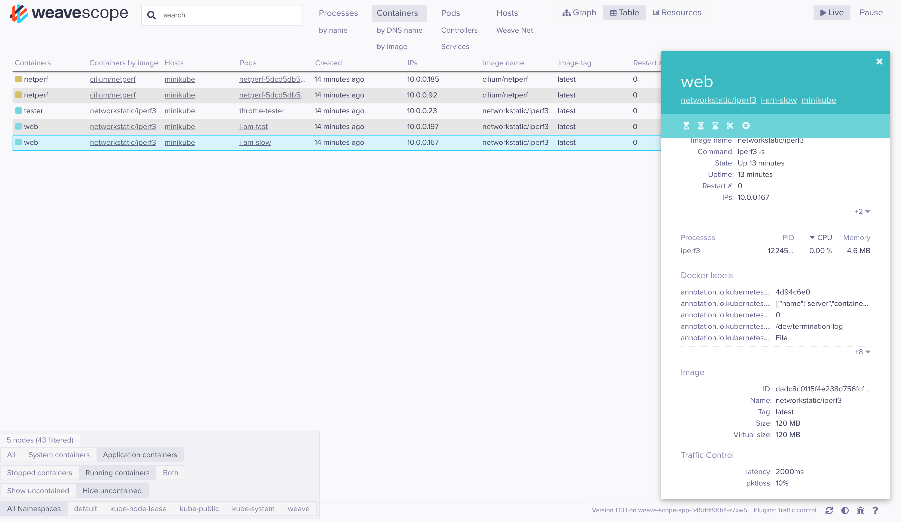

# Weave Works Scope + Traffic Control Plugin

Tested on EKS and Minikube  


Install Weave Scope  

```
kubectl apply -f scope.yml
```

Install Traffic Control plugin for Weave Scope -  

```
kubectl apply -f traffic-control.yml
```

Create some test pods -  

```
kubectl apply -f ../cni.kube.yml
```

Make Weave Scope + Traffic Control available, and modify the pods traffic settings -  

```
kubectl port-forward -n weave "$(kubectl get -n weave pod --selector=weave-scope-component=app -o jsonpath='{.items..metadata.name}')" 4040
```


High latency & 10% packet loss  




Low latency and no packet loss 


Run the [test.sh script](../test.sh)


Example output -  

```
Connecting to slow pod (10.0.0.167)
Connecting to host 10.0.0.167, port 5201
[  5] local 10.0.0.23 port 50038 connected to 10.0.0.167 port 5201
[ ID] Interval           Transfer     Bitrate         Retr  Cwnd
[  5]   0.00-2.00   sec  76.5 KBytes   313 Kbits/sec    1   13.7 KBytes
[  5]   2.00-3.00   sec  0.00 Bytes  0.00 bits/sec    0   13.7 KBytes
[  5]   3.00-4.00   sec  62.8 KBytes   514 Kbits/sec    0   27.3 KBytes
[  5]   4.00-5.00   sec  0.00 Bytes  0.00 bits/sec    0   27.3 KBytes
[  5]   5.00-6.00   sec  0.00 Bytes  0.00 bits/sec    0   27.3 KBytes
[  5]   6.00-7.00   sec   220 KBytes  1.80 Mbits/sec    0   54.6 KBytes
[  5]   7.00-8.00   sec  0.00 Bytes  0.00 bits/sec    0   54.6 KBytes
[  5]   8.00-9.00   sec   180 KBytes  1.48 Mbits/sec    0    109 KBytes
[  5]   9.00-10.00  sec  0.00 Bytes  0.00 bits/sec    0    115 KBytes
- - - - - - - - - - - - - - - - - - - - - - - - -
[ ID] Interval           Transfer     Bitrate         Retr
[  5]   0.00-10.00  sec   539 KBytes   442 Kbits/sec    1             sender
[  5]   0.00-11.97  sec   205 KBytes   140 Kbits/sec                  receiver

iperf Done.

Connecting to fast pod (10.0.0.197)
Connecting to host 10.0.0.197, port 5201
[  5] local 10.0.0.23 port 33826 connected to 10.0.0.197 port 5201
[ ID] Interval           Transfer     Bitrate         Retr  Cwnd
[  5]   0.00-1.00   sec  76.5 KBytes   625 Kbits/sec    0   16.4 KBytes
[  5]   1.00-2.00   sec   188 KBytes  1.54 Mbits/sec    0   54.6 KBytes
[  5]   2.00-3.00   sec  1.81 MBytes  15.2 Mbits/sec    0    437 KBytes
[  5]   3.00-4.03   sec  2.42 MBytes  19.6 Mbits/sec    0   1.68 MBytes
[  5]   4.03-5.00   sec  2.50 MBytes  21.7 Mbits/sec    0   4.26 MBytes
[  5]   5.00-6.00   sec  6.25 MBytes  52.4 Mbits/sec    0   6.02 MBytes
[  5]   6.00-7.00   sec  5.00 MBytes  41.9 Mbits/sec    0   6.02 MBytes
[  5]   7.00-8.00   sec  6.25 MBytes  52.4 Mbits/sec    0   6.02 MBytes
[  5]   8.00-9.00   sec  5.00 MBytes  41.9 Mbits/sec    0   6.02 MBytes
[  5]   9.00-10.01  sec  6.25 MBytes  52.1 Mbits/sec    0   6.02 MBytes
- - - - - - - - - - - - - - - - - - - - - - - - -
[ ID] Interval           Transfer     Bitrate         Retr
[  5]   0.00-10.01  sec  35.7 MBytes  30.0 Mbits/sec    0             sender
[  5]   0.00-10.51  sec  35.5 MBytes  28.3 Mbits/sec                  receiver

iperf Done.
```